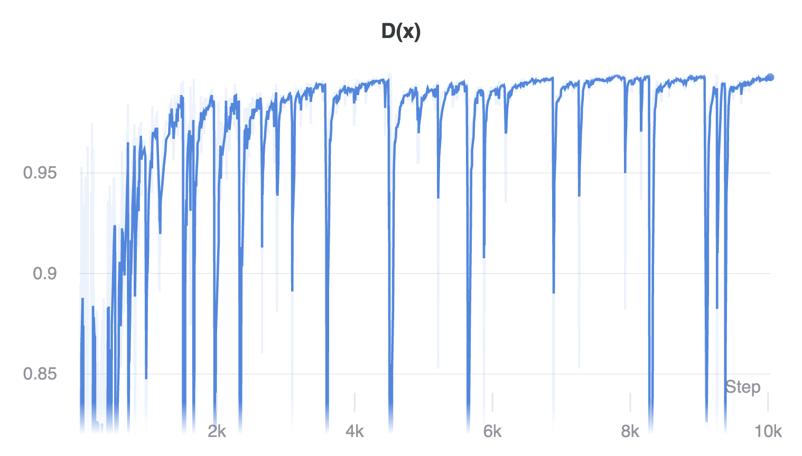
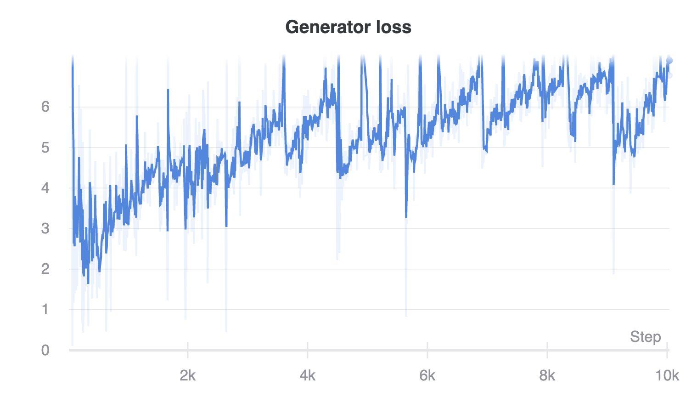
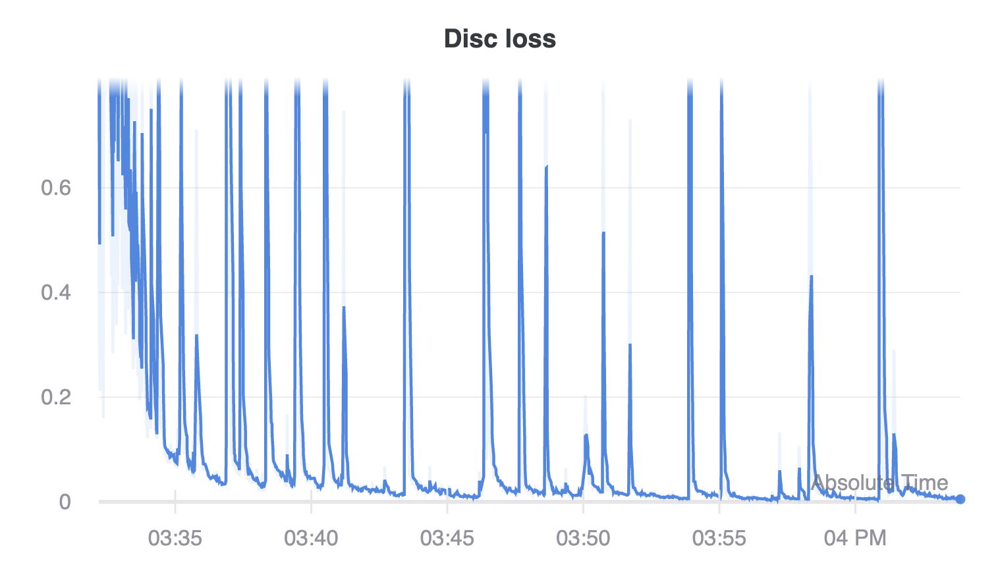
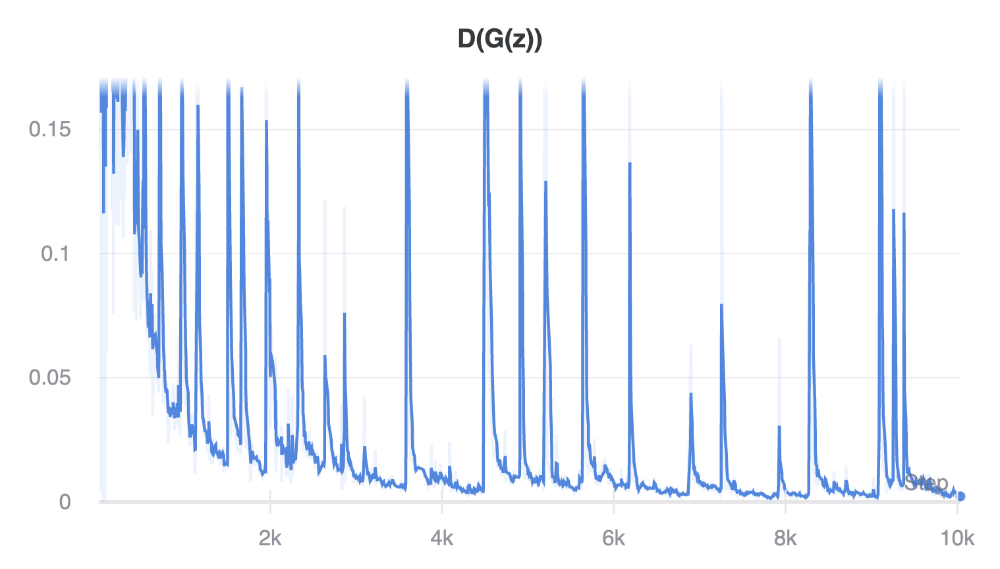
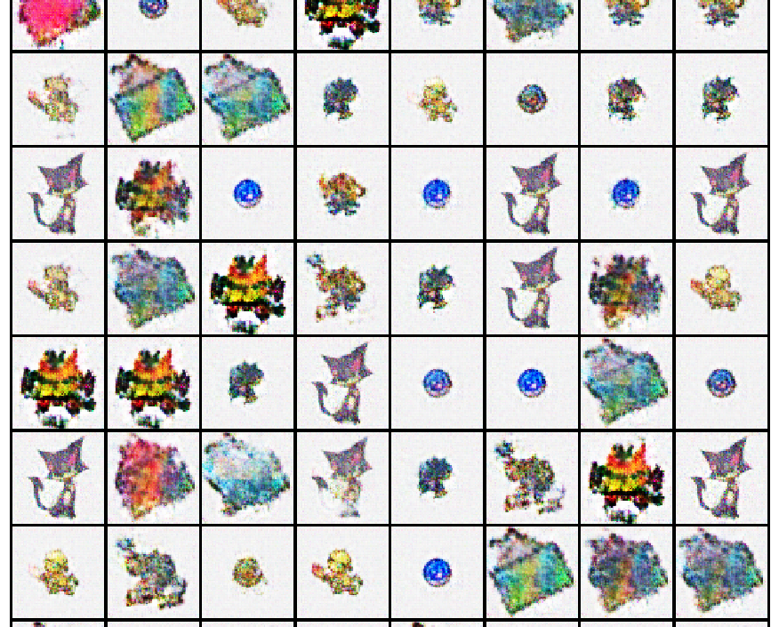
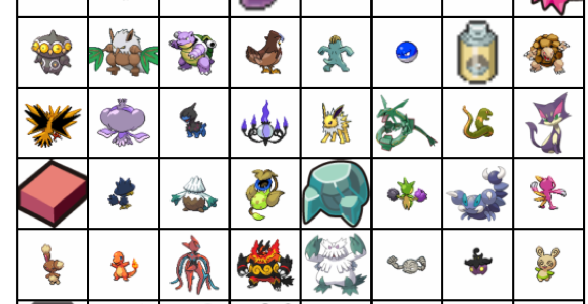

---
author:
- dfdf
title: 'Pokemon - DCGAN - Overfitting'
---

Training the GAN to generate these specific images
==================================================

Experiment
----------

In this experiment, we train DCGAN to generate images from 1 batch (128
images) of PokeSprites.

Results
-------

Fig. 1. 6500 iterations (there are a lot of good stuff before and after this... basically anything 2k-10k was like this)

Fig. 2. Training data

I like this one because there are some pictures of cats! You can kinda
match what's going on with the input images. Unfortunately, it's not as
clear as the input data, and it doesn't capture as many modes.

Mode collapse is a common problem in GANs, since there's nothing
explicitly discouraging it in the current setup. Actually, this is
something that I'll have to verify later, since I'm not sure if the
samples look the same because there are only 128 of them, and 100
dimensions in the latent space (ie, 2\^100 vectors). So it might be the
case that getting images which look the same in \"Generated images\"
might be normal!

However, it might still be interesting to try:

-   Using a different objective - Maybe we can play with the G and D
    objectives. Wasserstein loss, for example, is intended to optimise
    for the \"earth-mover's distance\" between two probability
    distributions. So it might give smoother convergence!

What does this mean?
--------------------

Another observation is that as we scrub through the iterations, we get
different generated images, even though we use `self.fixed_noise` to
generate the images!

Is the latent space changing a lot? Is it a thing where the generator
generates good stuff, and then the discriminator comes along and
distinguishes it, and then the generator has to move on and generate
other stuff? This might explain why the images generated per step are
completely different than the ones in previous steps. This might also
explain why there are spikes in the loss graph! At the spikes, the
generator discovers something cool.

Questions
---------

Should I train for longer? Will it ever approach input-quality?

9 Weights and Biases,
[https://wandb.com](https://app.wandb.ai/dfdf/dfdf/reports/Pokemon---DCGAN---Overfitting--Vmlldzo2MjY3MA/edit)
